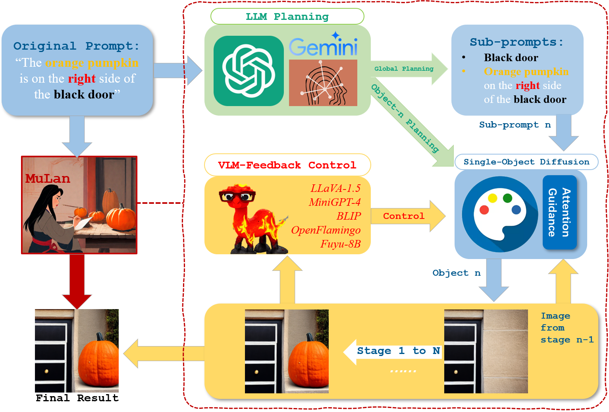
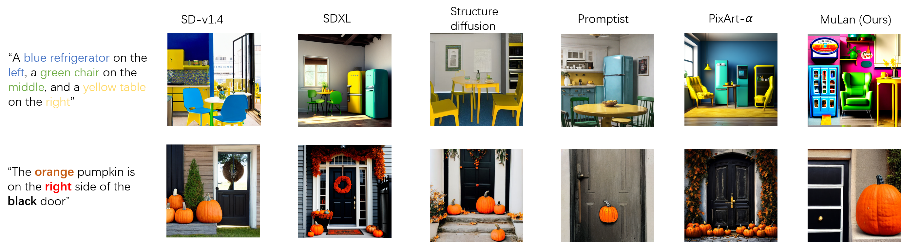

# MuLan: Multimodal-LLM Agent for Progressive Multi-Object Diffusion


Sen Li, [Ruochen Wang](https://ruocwang.github.io/), [Cho-Jui Hsieh](https://web.cs.ucla.edu/~chohsieh/), [Minhao Cheng](https://cmhcbb.github.io/), [Tianyi Zhou](https://tianyizhou.github.io/)

### **ARC**-**A**IGC **R**esearch **C**ollaboration

HKUST, UCLA, PSU, UMD

[Paper](https://arxiv.org/pdf/2402.12741.pdf), [Project website](https://measure-infinity.github.io/mulan), [Code](https://github.com/measure-infinity/mulan-code)




## TODO
- [x] MuLan with SD v1.4
- [x] MuLan with SDXL

## More visualization results


## Progressive multi-object diffusion

### Installation
```
git clone https://github.com/measure-infinity/mulan-code
cd mulan-code
conda create -n mulan python=3.10 -y
conda activate mulan
pip install -r ./requirements.txt
pip install -e git+https://github.com/CompVis/taming-transformers.git@master#egg=taming-transformers
pip install -e git+https://github.com/openai/CLIP.git@main#egg=clip
```

Configuring LLaVA (default VLM in the code)
```
git clone https://github.com/haotian-liu/LLaVA.git
cd LLaVA
pip install -e .
```

### Demo
Please modify you own GPT-4 API key in `query.py`, which is utilized for planning during the generation process. We recommend GPT-4 for the planning which is the default model in the code.

**SD-v1.4**

Please download the weights of Stable Diffusion v1.4 [here](https://huggingface.co/CompVis/stable-diffusion-v-1-4-original/resolve/main/sd-v1-4-full-ema.ckpt) and put it into the folder `sd-models`.

To generate an image with a complex prompt, first `cd scripts`, and then run

```python
from pipeline_sd import mulan_sd

mulan_sd(prompt="a black headphone is on the left of a green phone", seed=42, sd_model="../sd-models/sd-v1-4-full-ema.ckpt")
```
`seed`: Random seed, `prompt`: User prompt

The results will be saved in `outputs` by default. You can easily adjust the hyper-parameters of the [backward guidance](https://github.com/silent-chen/layout-guidance), `weight` (110. by default) and `thresh` (0.15 by default), to see how the results will change. 

**SDXL**

Please download the weights of SDXL [here](https://huggingface.co/stabilityai/stable-diffusion-xl-base-1.0) and put it into the folder `sd-models`. Currently we use DDIM sampler for the generation instead of the original one. Please replace the corresponding config files in the downloaded models with the files in `sdxl_configs`.

Please uninstall the library `diffusers` if you have one in the current environment. The code contains the modified library `diffusers`.

To generate an image with a complex prompt, first `cd scripts`, and then run

```python
from pipeline_sdxl import mulan_sdxl

mulan_sdxl(prompt="a black headphone is on the left of a green phone", seed=42)
```

`seed`: Random seed, `propmt`: User prompt

The results will be saved in `sdxl_outputs` by default.


## Bibtex
```
@misc{li2024mulan,
    title={MuLan: Multimodal-LLM Agent for Progressive Multi-Object Diffusion},
    author={Li, Sen and Wang, Ruochen and Hsieh, Cho-jui and Cheng, Minhao and Zhou, Tianyi},
    publisher={arXiv:2402.12741},
    year={2024},
}
```

## Acknowledgements
1. [Stable Diffusion](https://github.com/CompVis/stable-diffusion)
2. [Backward Guidance](https://github.com/silent-chen/layout-guidance)
3. [LLaVA](https://github.com/haotian-liu/LLaVA)


